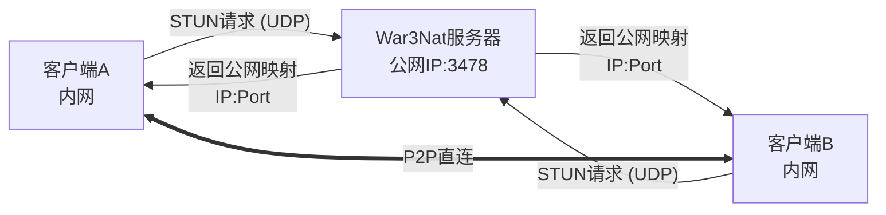

# War3Nat

**War3Nat** 是一个专为《魔兽争霸 III》P2P 连接设计的轻量级 STUN 服务器。它基于 C++ 和 Qt 框架开发，旨在为游戏客户端提供高效的 NAT 类型检测和公网地址发现服务，从而辅助建立稳定的点对点连接。

**工作原理示意：**



## ✨ 功能特性

*   🛡️ **协议兼容**：完整支持 RFC 5389 STUN 协议标准
*   🔍 **NAT 检测**：精准识别完全锥形、限制锥形、端口限制及对称型 NAT
*   🌍 **地址发现**：准确获取客户端的公网映射 IP 和端口
*   🚀 **高性能**：基于 Qt 异步 UDP 模型的非阻塞网络通信
*   🤝 **协同检测**：支持双服务器协同工作，提供更精确的 NAT 类型分析
*   💻 **跨平台**：完美支持 Windows、Linux 和 macOS

---

## 🛠️ 快速安装 (Ubuntu)

### 1. 环境准备与编译

```bash
# 1. 更新软件源并安装基础构建工具
sudo apt update
sudo apt install -y build-essential cmake

# 2. 安装 Qt5 网络模块依赖
sudo apt install -y qtbase5-dev qt5-qmake libqt5core5a libqt5network5

# 3. 克隆项目代码
git clone https://github.com/wuxiancong/War3Nat.git
cd War3Nat

# 4. 编译项目
mkdir build && cd build
cmake -DCMAKE_INSTALL_PREFIX=/usr/local/War3Nat ..
make -j$(nproc)

# 5. 安装 (将安装到 /usr/local/bin 和 /etc/War3Nat)
sudo make install

# 6. 验证安装结果
War3Nat --help
```
### 2. 重新编译
```bash
cd ~/War3Nat
git pull
cd build
make -j$(nproc)
sudo make install
sudo systemctl restart war3nat
```
---

## ⚙️ 系统服务配置

为了让 War3Nat 在后台稳定运行，建议配置 Systemd 服务。

### 1. 创建专用用户和目录

为了安全起见，建议使用非 root 用户运行服务。

```bash
# 1. 创建系统用户 War3Nat (无登录权限)
sudo useradd -r -s /bin/false -d /etc/War3Nat war3nat

# 2. 创建日志目录
sudo mkdir -p /var/log/War3Nat

# 3. 设置权限
# 确保 war3nat 用户能写入日志
sudo chown -R war3nat:war3nat /var/log/War3Nat
# 确保 war3nat 用户能读取配置
sudo chown -R war3nat:war3nat /etc/War3Nat
```

### 2. 安装配置文件

创建配置文件 `/etc/War3Nat/War3Nat.ini`：

```ini
[server]
port=3478
force_port_reuse=false
max_connections=1000
bind_address=0.0.0.0

[log]
level=info
enable_console=true
log_file=/var/log/War3Nat/War3Nat.log
max_size=10485760
backup_count=5

[stun]
protocol_version=5389
max_request_size=1024
response_timeout=5000

[security]
enable_whitelist=false
max_requests_per_minute=1000
```

### 3. 配置 Systemd 服务

创建服务文件 `sudo nano /etc/systemd/system/war3nat.service`：

> **注意**：请确保 `ExecStart` 指向您实际编译生成的二进制文件路径。建议将编译好的文件移动至 `/usr/local/bin/` 或修改下方路径。

以下配置假设使用 root 运行（简易模式），实际部署建议修改 `User` 为 `War3Nat` 并调整二进制文件权限。

```ini
[Unit]
Description=War3Nat STUN Server
After=network.target

[Service]
Type=simple

# 使用专用用户运行
User=war3nat
Group=war3nat

# 工作目录 (配置文件所在位置)
WorkingDirectory=/etc/War3Nat

# 启动路径 (指向安装位置)
ExecStart=/usr/local/War3Nat/bin/War3Nat -p 3478

# 自动重启策略
Restart=always
RestartSec=5

# 日志输出
StandardOutput=journal
StandardError=journal
PrivateTmp=true

[Install]
WantedBy=multi-user.target
```

### 4. 启动服务

```bash
# 重载配置
sudo systemctl daemon-reload

# 启用开机自启
sudo systemctl enable war3nat

# 启动服务
sudo systemctl start war3nat

# 停止服务
sudo systemctl stop war3nat
```

---

## 🖥️ 使用与管理

### 常用管理命令

```bash
# 查看服务状态
sudo systemctl status war3nat

# 查看实时日志
sudo journalctl -u war3nat -f

# 命令行手动运行 (调试模式)
./War3Nat -l debug -p 3478

# 杀死所有相关进程
pkill -f War3Nat
```

### 进程与端口监控

```bash
# 查看进程详情
ps aux | grep War3Nat

# 查看 UDP 端口监听状态 (3478)
ss -ulpn | grep 3478
# 或者
netstat -tulpn | grep 3478
```

---

## 🛡️ 防火墙配置

STUN 服务主要使用 UDP 协议的 3478 端口。

### 使用 UFW (Ubuntu 默认)

```bash
sudo ufw allow 3478/udp
sudo ufw reload
sudo ufw status
```

### 使用 Firewalld (CentOS/RHEL)

```bash
# 永久开放 UDP 端口
sudo firewall-cmd --permanent --add-port=3478/udp
sudo firewall-cmd --reload

# 验证配置
sudo firewall-cmd --query-port=3478/udp
```

---

## 🧪 测试与验证

### 1. 基础连通性测试 (Linux)

```bash
# 检查本地端口是否监听
sudo netstat -tulpn | grep 3478

# 抓包监控 STUN 流量
sudo tcpdump -i any -n udp port 3478
```

### 2. 标准 STUN 客户端测试

使用 `stuntman` 客户端验证服务功能。

```bash
# 安装客户端
sudo apt install stuntman-client

# 发起测试
stunclient 127.0.0.1 3478

# 预期输出示例：
# Binding test: success
# Local address: 192.168.1.100:54321
# Mapped address: 123.45.67.89:54321
# Behavior test: success
# Nat behavior: Endpoint Independent Mapping (完全锥形)
```

### 3. 远程连接测试 (Windows Client)

```powershell
# 使用 PowerShell 测试 UDP 端口连通性
Test-NetConnection <服务器IP> -Port 3478 -UDP

# CMD: 查看本地端口占用
netstat -ano -p UDP | findstr 3478

# Telnet 测试 (仅 TCP/基本连通性)
telnet <服务器IP> 3478
```

### 4. Python 模拟测试脚本

保存为 `test_stun.py` 并运行：

```python
#!/usr/bin/env python3
import socket
import struct
import binascii

def test_stun_server(server_ip='127.0.0.1', port=3478):
    sock = socket.socket(socket.AF_INET, socket.SOCK_DGRAM)
    sock.settimeout(5)
    
    # 构建 STUN Binding Request (RFC 5389)
    # Header: Type(0x0001) + Length(0x0000) + MagicCookie(0x2112A442) + TransactionID
    transaction_id = b'\x00\x01\x02\x03\x04\x05\x06\x07\x08\x09\x0a\x0b'
    stun_request = struct.pack('>HH', 0x0001, 0)
    stun_request += struct.pack('>I', 0x2112A442)
    stun_request += transaction_id
    
    try:
        sock.sendto(stun_request, (server_ip, port))
        print(f"STUN 请求已发送到 {server_ip}:{port}")
        
        response, addr = sock.recvfrom(1024)
        print(f"收到 STUN 响应 from {addr}")
        
        # 简单验证响应头
        if len(response) >= 20:
            msg_type = struct.unpack('>H', response[0:2])[0]
            if msg_type == 0x0101:  # Binding Response
                print("✅ STUN 服务器响应正常")
                return True
    except socket.timeout:
        print("❌ STUN 请求超时")
    except Exception as e:
        print(f"发生错误: {e}")
    finally:
        sock.close()
    return False

if __name__ == "__main__":
    test_stun_server()
```

---

## 📂 项目结构

```text
War3Nat/
├── CMakeLists.txt          # CMake 构建配置
├── War3Nat.pro             # QMake 项目文件
├── include/                # 头文件
│   ├── War3Nat.h           # 核心逻辑类
│   └── logger.h            # 日志系统
├── src/                    # 源代码
│   ├── main.cpp            # 入口文件
│   ├── War3Nat.cpp         # 核心实现
│   └── logger.cpp          # 日志实现
├── config/                 # 配置文件
│   ├── War3Nat.ini         # 配置模板
│   └── War3Nat.service     # Systemd 服务文件
└── bin/                    # 编译输出目录
    └── War3Nat
```

---

## 📚 协议与技术细节

### 支持的 STUN 协议

*   **方法 (Methods)**:
    *   `Binding Request (0x0001)`
    *   `Binding Response (0x0101)`
*   **属性 (Attributes)**:
    *   `XOR-MAPPED-ADDRESS (0x0020)`: 返回经过异或处理的公网地址
    *   `SOFTWARE (0x8022)`: 服务器软件标识
    *   `FINGERPRINT (0x8028)`: 消息完整性指纹

### NAT 类型定义

| 类型 | 描述 | 连接难度 |
| :--- | :--- | :--- |
| **Full Cone** | 完全锥形 NAT | 极易 (任何外部主机均可访问) |
| **Restricted Cone** | 限制锥形 NAT | 容易 (仅限制 IP) |
| **Port Restricted** | 端口限制锥形 NAT | 中等 (限制 IP 和端口) |
| **Symmetric** | 对称型 NAT | 困难 (每次会话映射不同端口) |

### 客户端集成示例 (C++)

```cpp
#include "NetworkDetector.h"

// 获取检测器实例
NetworkDetector& detector = NetworkDetector::instance();

// 发起双服务器检测
// 需要两个不同的 STUN 服务器地址来准确判定 NAT 类型
detector.startDualServerNATDetection(
    QHostAddress("stun1.yourdomain.com"), 3478,
    QHostAddress("stun2.yourdomain.com"), 3478
);

// 连接信号获取结果
QObject::connect(&detector, &NetworkDetector::dualServerNATTestCompleted,
    [](NetworkDetector::DualServerNATType type) {
        qDebug() << "NAT 类型:" << detector.dualServerNATTypeToString(type);
        qDebug() << "公网地址:" << detector.getPublicAddress().toString()
                 << ":" << detector.getPublicPort();
});
```

---

## 🔧 故障排查

### 常见问题

**1. 端口被占用 (Port 3478 is already in use)**
```bash
# 方案 A: 查找并杀掉占用进程
sudo netstat -tulpn | grep 3478
sudo kill <PID>

# 方案 B: 强制端口重用启动 (需代码支持)
./War3Nat -f -p 3478
```

**2. 权限不足 (Permission denied)**
```bash
# 方案 A: 使用 sudo 运行
sudo ./War3Nat

# 方案 B: 赋予二进制文件绑定低端口的权限 (推荐)
sudo setcap 'cap_net_bind_service=+ep' /path/to/War3Nat
```

**3. 调试模式**
```bash
# 启用详细日志并在控制台输出
./War3Nat -l debug -p 3478
```

### 性能监控

```bash
# 监控进程资源使用
top -p $(pgrep War3Nat)

# 监控当前连接数
ss -u -a | grep 3478 | wc -l
```

---

## 🗑️ 卸载指南 (Ubuntu)

如果需要完全移除 War3Nat：

```bash
# 1. 停止并禁用服务
sudo systemctl stop war3nat
sudo systemctl disable war3nat
sudo rm /etc/systemd/system/war3nat.service
sudo systemctl daemon-reload

# 2. 删除文件和目录
sudo rm -rf /opt/War3Nat
sudo rm -rf /var/log/War3Nat /etc/War3Nat

# 3. 删除系统用户
sudo userdel War3Nat

# 4. 移除依赖库 (可选)
sudo apt remove qtbase5-dev qt5-qmake libqt5core5a libqt5network5
sudo apt autoremove
```
